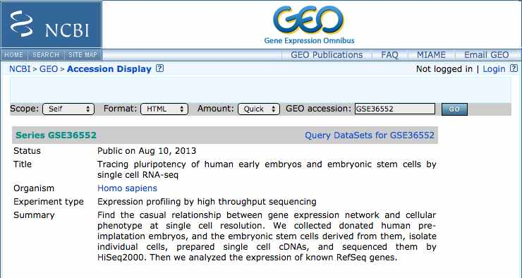
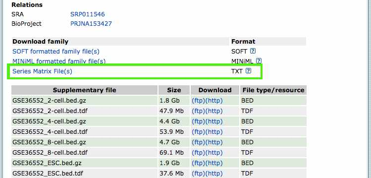

# shoelace #

A python package for RNA sequence data and expression level analysis and utilities for querying the <a href="http://www.ncbi.nlm.nih.gov/geo/">NCBI Gene Expression Omnibus (GEO)</a> database.  This package is written for Linux/*nix and uses <a href="https://github.com/ncbi/sra-tools/wiki/Downloads">sratools</a>, <a href="http://bowtie-bio.sourceforge.net/index.shtml">bowtie</a>, and <a href="http://deweylab.biostat.wisc.edu/rsem/">RSEM</a> to retrieve FASTQ data, manipulate it, align to reference genomes, and estimate expression levels.

### Requirements
-------------------
* Tested with Python 2.7.1
* <a href="http://biopython.org/wiki/Main_Page">Biopython</a>, <a href="http://www.numpy.org/">NumPy</a>, <a href="http://www.scipy.org/">SciPy</a>, <a href="http://matplotlib.org/">matplotlib</a>, <a href="http://scikit-learn.org/">scikit-learn</a>
* <a href="https://github.com/ncbi/sra-tools/wiki/Downloads">sratools</a>
* <a href="http://bowtie-bio.sourceforge.net/index.shtml">bowtie</a>
* <a href="http://deweylab.biostat.wisc.edu/rsem/">RSEM</a>
* HPC cluster job manager (LSF) utilities tested on Platform LSF HPC 7 Update 6

### Installation
-------------------
Clone the repository.

    git clone https://github.com/ChellyD65/shoelace.git <installdir>

In your python script or code, add the path to the 'python/mmdgeneticstools' directory

    sys.path.append('<installdir>/python/mmdgeneticstools')
    from mmdgeneticstools.lib import *
    
#### Main tools
-------------------
Most of shoelace is in the form of a python package 'mmdgeneticstools' which can be imported into your own scripts.  Some example scripts are included in the shoelace/python/mmdgeneticstools/scripts/ directory:

* Analyze_RSEM_results.py -- Analysis of RSEM *.genes.results output files; sorts genes based on hg38 annotations from BioMart, does PCA, cross-correlation, etc.
* Shuffletown -- randomly distributes (paired end) FASTQ reads in multiple files into a number of new files

The shoelace/python/mmdgeneticstools/lib/ directory contains the modules that can be imported.  Some of these can be run as standalone scripts from the command line:

* Plotter.py -- Generates figures summarizing expression data, correlation, and cluster analysis.

##### Utility tools
-------------------
Perl and BASH shell scripts that may be helpful, especially in the HPC environment.

* Job management tools -- submits multiple bowtie and RSEM jobs to and LSF cluster in an organized way
    *  Align_All_Cells_In_Dir.sh
    *  RSEM-calc-expression_All_Cells_In_Dir.sh
* Split and Merge -- perl scripts that merge paired end read files from *_1.fastq and *_2.fastq into a single file, and split them back apart if needed

### Typical Workflow
-------------------
Find the GEO accession number in provided in the paper for the study you are interested in.  
Search for it at http://www.ncbi.nlm.nih.gov/gds.

For example, we'll work with some data from this paper on the transcriptome of human pre-implantation embryos: Yan L, Yang M, Guo H, Yang L et al. Single-cell RNA-Seq profiling of human preimplantation embryos and embryonic stem cells. Nat Struct Mol Biol 2013 Sep;20(9):1131-9. PMID: <a href="http://www.ncbi.nlm.nih.gov/pubmed/23934149">23934149</a>

The GEO Accession number is <b>GSE36552</b>.  A search brings up this <a href="http://www.ncbi.nlm.nih.gov/geo/query/acc.cgi?acc=GSE36552">page<a/>: 

Find the link to the "Series Matrix File(s)".

Retrieve that file.

     wget ftp://ftp.ncbi.nlm.nih.gov/geo/series/GSE22nnn/GSE22182/matrix/GSE22182_series_matrix.txt.gz

Create a configuration file for this project.  A template is located in the python/shoelace/ directory.

     cp <shoelace_install_dir>/shoelace/python/shoelace/default_config.txt  <ProjectDir>/Yan_2013.config

Edit the configuration file with the appropriate paths.  SeriesMetaDataDir is the location of the config file (<ProjectDir> in this walkthrough). fastq_dir, and virtual_fastq_dir can be any directories you like (they will be created if they do not exist).

